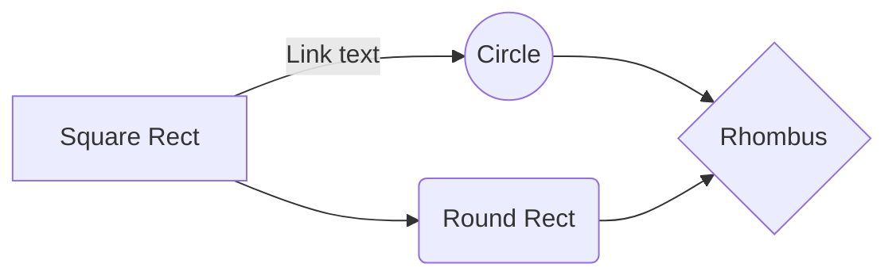

# 인간과 바나나의 유전적 일치도 구하기

이 프로젝트를 진행하게 된 이유는 ...
왜 하필 바나나인지 ...
유전적 일치도란 ...
이므로, 이 프로젝트를 통해 추후 바나나 수명 연장 연구의 기초 자료료 활용될 수 있을 것으로 으로 기대하였다.

유전적 일치도를 구하는 방법이 여러가지가 있어 하나의 답은 얻지 못하였지만,
인간과 바나나의 유전적 일치도는 대략 50% 정도라고 결론을 내릴 수 있었다.

## 사용한 파일 및 프로그램

1. 인간 유전체 파일 (www.123.333 에서 다운로드)
2. 인간 유전체의 gff3 파일 (www.133.445)
3. BLAST (2.13.0+) (www.4444.555)
4. BWA (0.67) (www.234.444)

## 목차

1. Preprocessing
2. 인간 유전체와 바나나 유전체의 유사도 비교
3. 인간 단백질과 바나나 단백질의 유사도 비교
4. 결론

## 1. Preprocessing

1) 인간 유전체 파일 다운받기

    wget www.123.333

2) 바나나 유전체 파일 다운받기

    wget www.123.333
    
3) 인간 유전체 파일을 gff3 파일에 맞게 수정하기

   
111.py

결과

 
 ## 2. 인간 유전체와 바나나 유전체의 유사도 비교

